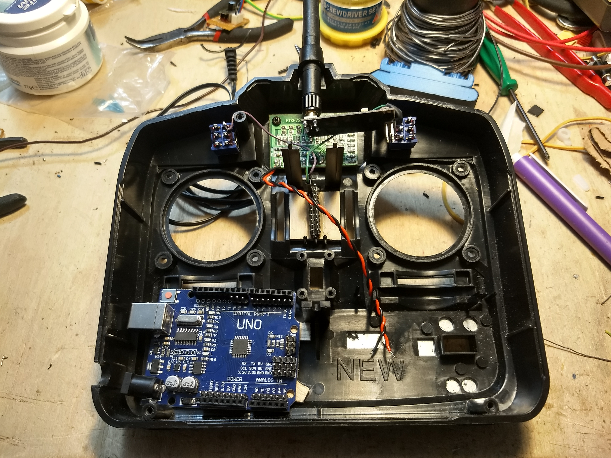
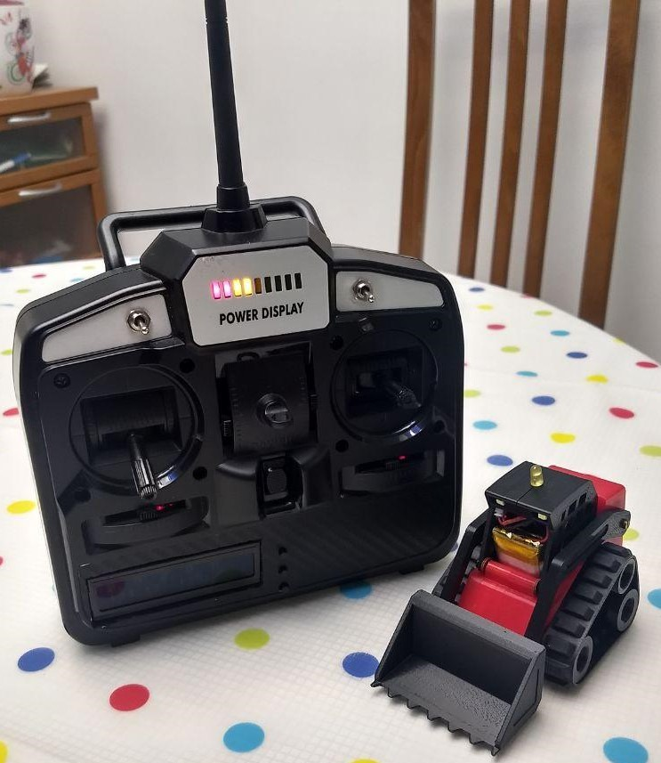

# Remote-Controller-Arduino
Simple project based on Arduino Uno clone, NRF21L01 module, Display LCD 16x2 Characters and old radio controller frame.

## Components position

## Final Assembly Inside

## Final Assembly Outside
